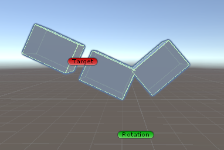
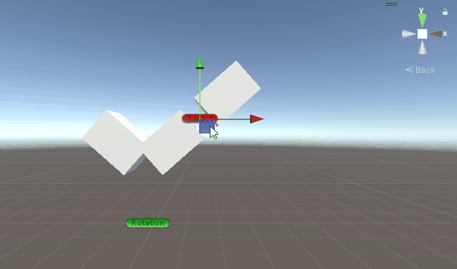
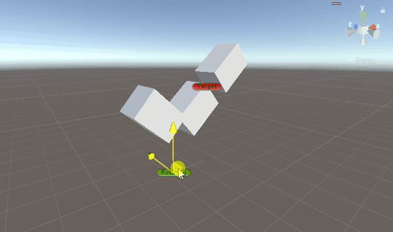

### Welcome to my ik project 👋

<!-- ABOUT THE PROJECT -->
## About The Project

First of all, this project has the objective of making an ik tool, a simple and an ik chain too.

## Setup

What are we beginning with? First the script `SimpleIK.cs` needs to be in the scene on an object.

Here's what we need next:
* 1 arm with 3 GameObjects
* 1 empty for the position target
* 1 empty for the rotation target

Next let's see how to make it work!

On the script:
* __*Bones*__ is just the list of bones we want to affect
* __*Target*__ for the position one
* __*Rotation Target*__ for the rotation one
* __*Offset*__ is a parameter for rotation of the bones, sometime bones are not in the right direction
* __*Shoulder Offset*__ as the previous one it's for the rotation of the arm this time

 ## Examples of the length limit and rotation in practice
 
 
