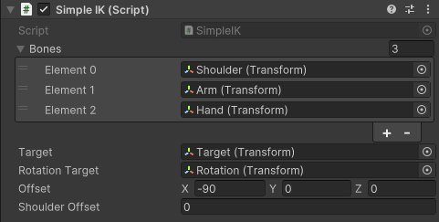

### Welcome to my inverse kinematic project for Unity 👋

<!-- ABOUT THE PROJECT -->
## About The Project

The project has two objectives: first, to create a simple inverse kinematics tool; and second, to create an inverse kinematics chain (with more than one joint).

## Setup

Where do we start? First, the script `SimpleIK.cs` needs to be added  to an object in the scene.

Here's what we need next:
* one arm with three GameObjects;
* one empty GameObject for the position target;
* one empty GameObject for the rotation target.

Now let's see how to make it work!

In the script:
* __*Bones*__ is just a list of the bones we want to affect.
* __*Target*__ for the position one.
* __*Rotation Target*__ is for the rotation one.
* __*Offset*__ is a parameter for the rotation of the bones. Sometimes, the bones are not in the right direction.
* __*Shoulder Offset*__ is similar to the previous one; it's for the rotation of the arm.

 ## Here are some examples of the length limit and rotation in practice:
 
 
